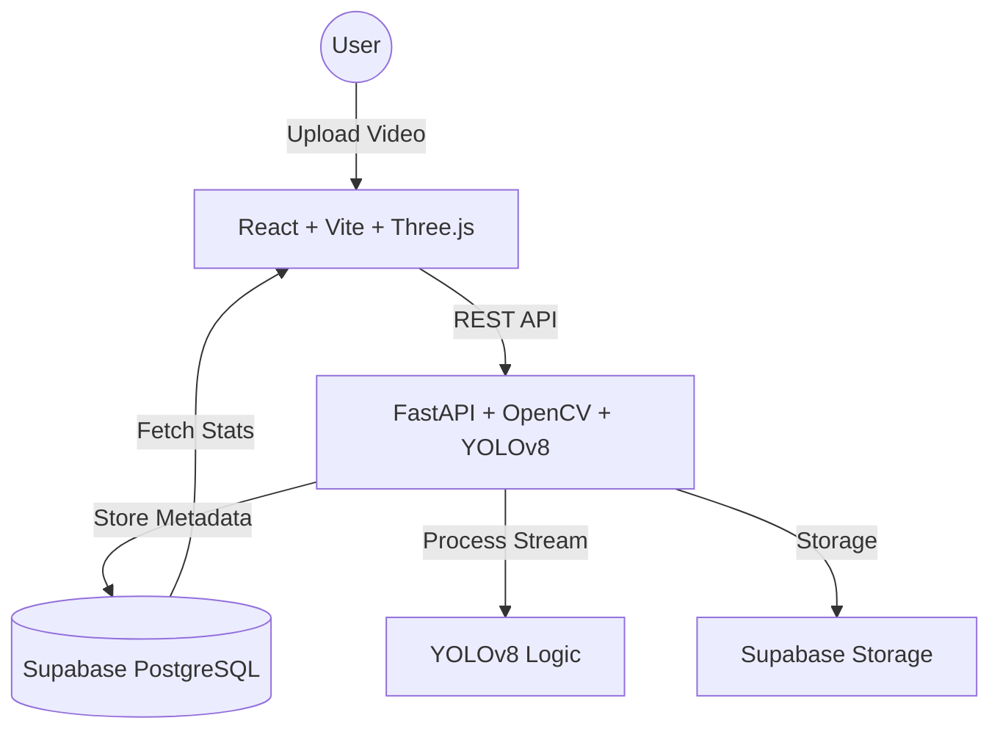

# 🚗 Vtrack: Enterprise Traffic Analysis System

[](https://vercel.com)
[](https://huggingface.co)
[](https://fastapi.tiangolo.com)
[](https://ultralytics.com)
[](https://reactjs.org)
[](https://supabase.com)

**Vtrack** is a state-of-the-art computer vision platform designed for real-time traffic monitoring and analytics. It combines deep learning-based vehicle detection with an interactive 3D dashboard to provide detailed insights into traffic flow, vehicle classification, and speed monitoring.

---

## 🌟 Key Features

### 🤖 AI-Powered Analytics
- **Multi-Class Detection**: Real-time identification of cars, trucks, buses, and motorcycles using **YOLOv8s**.
- **Accurate Tracking**: ByteTrack implementation for robust vehicle re-identification across frames.
- **Speed Estimation**: Dynamic velocity calculation based on camera calibration.
- **AI System Intelligence Feed**: A live sci-fi inspired stream of model detections and system performance metrics.

### 📈 Interactive Dashboards
- **3D Traffic Scene**: An immersive React Three Fiber environment that visualizes data with a professional, glassmorphic UI.
- **Live Statistics**: Real-time counters for entering/exiting vehicles and average speed metrics.
- **Recent Activity Feed**: Histroical log of processed videos with deep-linked results.

### 🎯 Advanced Controls
- **Precision Calibration**: User-defined pixels-per-meter ratio using a visual draw-reference tool.
- **Directional Counting**: Virtual counting lines with custom directions (Entering, Exiting, or Both).
- **Global Stats**: Aggregated data across all processed jobs stored in Supabase.

---

## 🏗️ Technical Architecture



### Tech Stack
- **Frontend**: React 18, Vite, React Three Fiber (Three.js), Tailwind CSS, Framer Motion.
- **Backend**: FastAPI, OpenCV, Ultralytics (YOLOv8), Python 3.11.
- **Database**: Supabase (PostgreSQL) with Real-time triggers.
- **Infrastructure**: Dockerized Backend on Hugging Face Spaces, Frontend on Vercel.

---

## 🚀 Getting Started

### Prerequisites
- Python 3.11+
- Node.js 18+
- Supabase account

### Backend Setup
1. Navigate to `backend/`
2. Install dependencies: `pip install -r requirements.txt`
3. Create a `.env` file with your Supabase credentials:
   ```env
   SUPABASE_URL=your_url
   SUPABASE_KEY=your_key
   ```
4. Start the server: `uvicorn app:app --reload --port 7860`

### Frontend Setup
1. Navigate to `frontend/`
2. Install dependencies: `npm install`
3. Start the development server: `npm run dev`
4. The app will be available at `http://localhost:5173`

---

## 📁 Project Structure

```text
├── backend/
│   ├── src/
│   │   ├── analytics/    # Speed, Counting, Heatmap logic
│   │   ├── detection/    # YOLOv8 implementation
│   │   ├── tracking/     # ByteTrack / Sorting
│   │   └── utils/        # DB Clients & Metrics
│   ├── app.py            # FastAPI Entry point
│   └── Dockerfile        # HF Spaces deployment
├── frontend/
│   ├── src/
│   │   ├── components/   # 3D, Dashboard, Calibration UI
│   │   ├── services/     # API integration
│   │   └── utils/        # Constants & Hooks
│   └── vite.config.js
└── .github/              # CI/CD Workflows
```

---

## 📄 License
This project is licensed under the MIT License - see the [LICENSE](LICENSE) file for details.

Developed with ❤️ as a portfolio showcase.
